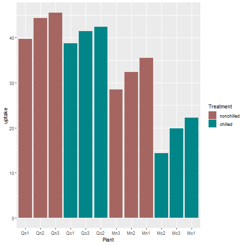

Shiny Project Presentation
========================================================
author: Courtney Rowlands
date: 18-October-2019
autosize: true

Shiny Application & Reproducible Pitch
========================================================

This peer assessed assignment has two parts. First, you will create a Shiny application and deploy it on Rstudio's servers. Second, you will use Slidify or Rstudio Presenter to prepare a reproducible pitch presentation about your application.

- Write a shiny application with associated supporting documentation. The documentation should be thought of as whatever a user will need to get started using your application.
- Deploy the application on Rstudio's shiny server
- Share the application link by pasting it into the provided text box
- Share your server.R and ui.R code on github

The application must include the following:
========================================================
- Some form of input (widget: textbox, radio button, checkbox, ...)
- Some operation on the ui input in sever.R
- Some reactive output displayed as a result of server calculations
- You must also include enough documentation so that a novice user could use your application.
- The documentation should be at the Shiny website itself. Do not post to an external link.

co2 Data Analyses
========================================================


```r
summary(co2)
```

```
   Min. 1st Qu.  Median    Mean 3rd Qu.    Max. 
  313.2   323.5   335.2   337.1   350.3   366.8 
```

```r
head(co2)
```

```
[1] 315.42 316.31 316.50 317.56 318.13 318.00
```

```r
str(co2)
```

```
 Time-Series [1:468] from 1959 to 1998: 315 316 316 318 318 ...
```

co2 Plot
========================================================


